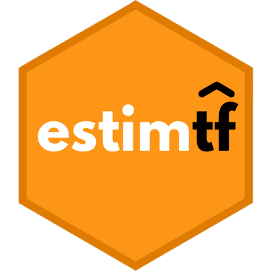

<!-- README.md is generated from README.Rmd. Please edit that file -->

```{r, include = FALSE}
knitr::opts_chunk$set(
  collapse = TRUE,
  comment = "#>",
  fig.path = "man/figures/README-",
  out.width = "100%"
)
```

```{r echo=FALSE, results="hide", message=FALSE}
library(badger)
library(badgecreatr)
```


<!-- badges: start -->
<!-- [](https://github.com/SaraGarcesCespedes/estimtf/actions) -->
[](https://www.gnu.org/licenses/gpl-3.0.en.html)

[](https://cran.r-project.org/package=estimtf)
<!-- [](https://travis-ci.com/SaraGarcesCespedes/estimtf) -->
<!-- badges: end -->

# estimtf 

The `estimtf` package provides functions to find the Maximum Likelihood Estimates of parameters from probability distributions and linear regression models using the TensorFlow optimizers.

## Installation

You can install `estimtf` from GitHub. It is recommended to follow these steps to avoid problems when using the package:

``` r
# Step 1: Install the reticulate package
install.packages("reticulate")
library(reticulate)

# Step 2: Install the tensorflow package
install.packages("tensorflow")
library(tensorflow)

# Step 3: Use the install_tensorflow() funcion to install the TensorFlow module
install_tensorflow()

# Step 4: Confirm that the TensorFlow installation succeded
library(tensorflow)
tf$constant("Hello Tensorflow")

# Step 5: Install the devtools package
install.packages("devtools")

# Step 6: Install and load the estimtf package
devtools::install_github("SaraGarcesCespedes/estimtf", force=TRUE)
library(estimtf)
```

## Example

This is a basic example that shows how to estimate the mean and standard deviation parameters from the normal distribution using the `mle_tf` function:


```{r example}
# Load the estimtf package
library(estimtf)

# Estimation of parameters mean and sd from the normal distribution

# Generate a sample from the normal distribution
x <- rnorm(n = 1000, mean = 10, sd = 3)

# Find the MLE of the parameters using the mle_tf function
estimation <- mle_tf(x, 
                     xdist = "Normal", 
                     optimizer = "AdamOptimizer",
                     initparam = list(mean = 0.5, sd = 0.5),
                     hyperparameters = list(learning_rate = 0.1))

# Get the summary of the estimates
summary(estimation)

```


You can visit the [package website](https://saragarcescespedes.github.io/estimtf/) to explore the function reference. 
